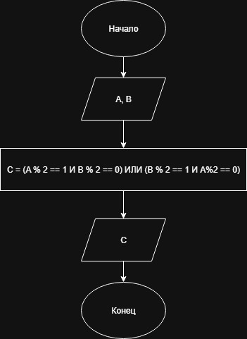

# Домашнее задание к работе 4

## Условие задачи
 Два программиста, Анна (А) и Борис (В), дежурят ночью. Чтобы было не так скучно, они решили, что будут пить кофе только если кто то один из них чётный (по номеру своего рабочего места). Запишите услвоие для кофе-машины.
---
## 1. Алгоритм и блок схема

### Алгоритм
1. **Начало**
2. Объявить переменные:
   - `numberA` - номер места Анны
   - `numberB` - номер места Бориса
   - `rez` - результат
3. Запросить номера мест у пользователя.
5. Вычислить условие `(numberA % 2 == 1 && numberB % 2 == 0) || (numberB % 2 == 1 && numberA % 2 == 0)`:
6. Вывести результаты вычислений.
7. **Конец**

### Блок-схема


 [Ссылка на блок-схему](https://viewer.diagrams.net/?tags=%7B%7D&lightbox=1&highlight=0000ff&edit=_blank&layers=1&nav=1&title=Lab4_schema.drawio&dark=auto#Uhttps%3A%2F%2Fdrive.google.com%2Fuc%3Fid%3D1B8hkz6EBm_bKWojequkNudj5Ya2yKsxA%26export%3Ddownload)

 ## 2. Реализация программы

```c
#include <stdio.h>
#include <locale.h>

int main()
{
	int numberA;
	int numberB;
	int rez;

	setlocale(LC_ALL, "RUS");

	puts("Введите номера ваших рабочих мест через пробел (А и В)...");
	scanf("%d %d", &numberA, &numberB);

	rez = (numberA % 2 == 1 && numberB % 2 == 0) || (numberB % 2 == 1 && numberA % 2 == 0);

	printf("Вы пьёте кофе (1 - да; 0 - нет): %d\n",rez);

	return 0;
}
```
# 3. Результаты работы программы
Введите номера ваших рабочих мест через пробел (А и В)...
62 31
Вы пьёте кофе (1 - да; 0 - нет): 1
# 4. Информация о разработчике
Авраменко Дмитрий бИПТ-251
